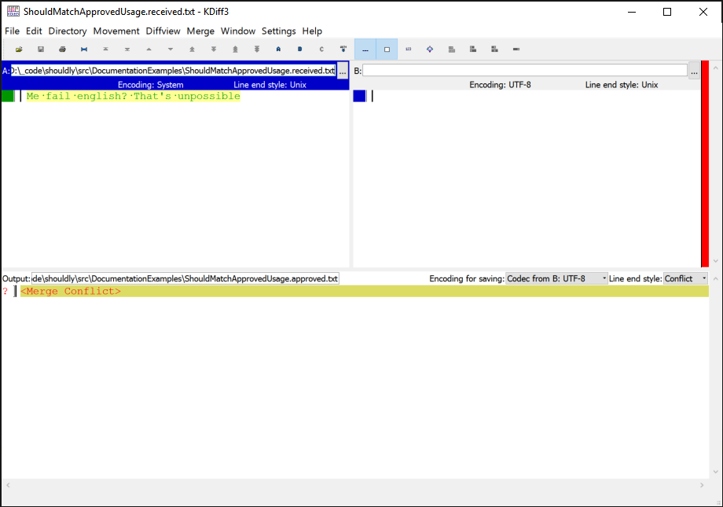
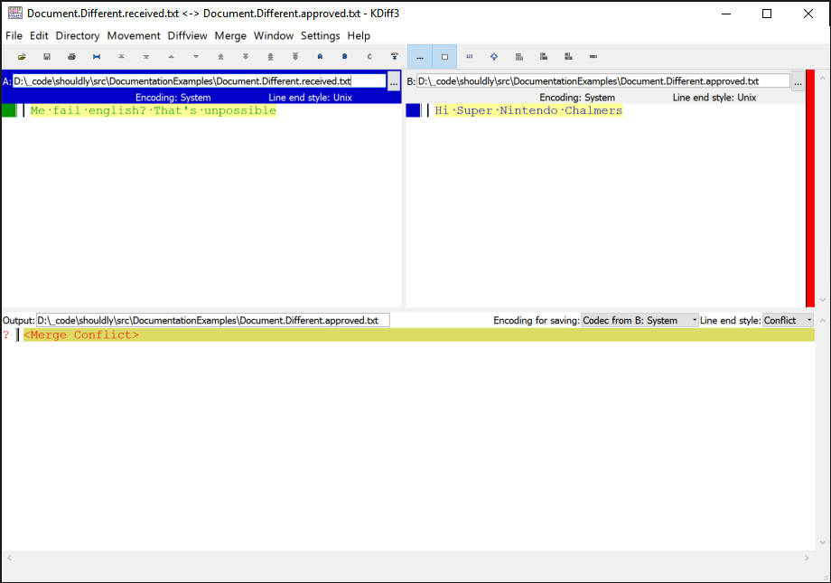

# ShouldMatchApproved

Based on the [ApprovalTest.Net](https://github.com/approvals/ApprovalTests.Net), Shouldly has `ShouldMatchApproved()` to do approval based testing. The main goal of Shouldly's approval testing is for it to be simple, intuitive and give great error messages.

To configure failed approvals to display a comparison of the approved and failed files, install the [Shouldly.DiffEngine](https://www.nuget.org/packages/Shouldly.DiffEngine/) nuget package and confgure it as follows:

```
// In your test setup
ShouldlyConfiguration.ShouldMatchApprovedDefaults.ConfigureDiffEngine();
```


## Approved File does not exist

When you first run a `ShouldMatchApproved` test, you will be presented with a diff viewer and a failing test.

<!-- snippet: ShouldMatchApprovedExamples.ApprovedFileDoesNotExist.codeSample.approved.cs -->
<a id='snippet-ShouldMatchApprovedExamples.ApprovedFileDoesNotExist.codeSample.approved.cs'></a>
```cs
var simpsonsQuote = "Hi Super Nintendo Chalmers";
simpsonsQuote.ShouldMatchApproved();
```
<sup><a href='/src/DocumentationExamples/CodeExamples/ShouldMatchApprovedExamples.ApprovedFileDoesNotExist.codeSample.approved.cs#L1-L2' title='Snippet source file'>snippet source</a> | <a href='#snippet-ShouldMatchApprovedExamples.ApprovedFileDoesNotExist.codeSample.approved.cs' title='Start of snippet'>anchor</a></sup>
<!-- endSnippet -->

**Exception**

<!-- include: ShouldMatchApprovedExamples.ApprovedFileDoesNotExist.exceptionText.approved.txt -->
```
To approve the changes run this command:
copy /Y "C:\PathToCode\shouldly\src\DocumentationExamples\ShouldMatchApprovedExamples.ApprovedFileDoesNotExist.received.txt" "C:\PathToCode\shouldly\src\DocumentationExamples\ShouldMatchApprovedExamples.ApprovedFileDoesNotExist.approved.txt"
----------------------------

Approval file C:\PathToCode\shouldly\src\DocumentationExamples\ShouldMatchApprovedExamples.ApprovedFileDoesNotExist.approved.txt
    does not exist
```
<!-- endInclude -->

**Screenshot**




## Approved File does not match received

After you have approved the text, when it changes you get a different experience.

<!-- snippet: ShouldMatchApprovedExamples.ApprovedFileIsDifferent.codeSample.approved.cs -->
<a id='snippet-ShouldMatchApprovedExamples.ApprovedFileIsDifferent.codeSample.approved.cs'></a>
```cs
var simpsonsQuote = "Me fail english? That's unpossible";
simpsonsQuote.ShouldMatchApproved();
```
<sup><a href='/src/DocumentationExamples/CodeExamples/ShouldMatchApprovedExamples.ApprovedFileIsDifferent.codeSample.approved.cs#L1-L2' title='Snippet source file'>snippet source</a> | <a href='#snippet-ShouldMatchApprovedExamples.ApprovedFileIsDifferent.codeSample.approved.cs' title='Start of snippet'>anchor</a></sup>
<!-- endSnippet -->

**Exception**

<!-- include: ShouldMatchApprovedExamples.ApprovedFileIsDifferent.exceptionText.approved.txt -->
```
To approve the changes run this command:
copy /Y "C:\PathToCode\shouldly\src\DocumentationExamples\ShouldMatchApprovedExamples.ApprovedFileIsDifferent.received.txt" "C:\PathToCode\shouldly\src\DocumentationExamples\ShouldMatchApprovedExamples.ApprovedFileIsDifferent.approved.txt"
----------------------------

simpsonsQuote
    should match approved with options: Ignoring line endings
"Hi Super Nintendo Chalmers"
    but was
"Me fail english? That's unpossible"
```
<!-- endInclude -->

**Screenshot**




## Options and customisation

While the defaults should work fine, often you need to customise things easily. ApprovalTests is highly configurable but the configuration is not always discoverable. Shouldly wants to make configuration simple and discoverable. This section covers the local customisations availble for a single ShouldMatchApproved call.


### Defaults

The first thing to note is that by default **Shouldly ignores line endings**. This saves painful failures on the build server when git checks out the approved files with `\n` rather than `\r\n` which the received file has. You can opt out of this behaviour for a single call, or globally. For global defaults see the Configuration section.


### Usage

```
toVerify.ShouldMatchApproved(configurationBuilder => configurationBuilder.OPTION())
```

Where OPTION can be one of the following methods.


### DoNotIgnoreLineEndings

Tells shouldly to use a line ending sensitive comparison.

```
toVerify.ShouldMatchApproved(c => c.DoNotIgnoreLineEndings())
```


### WithStringCompareOptions

Sets the string comparison options

```
var options = StringCompareShould.IgnoreCase | StringCompareShould.IgnoreLineEndings;
toVerify.ShouldMatchApproved(c => c.WithStringCompareOptions(options))
```


### WithDiscriminator

By default the approved and received files are named `${MethodName}.approved.txt`, `WithDiscriminator` allows you to discriminate multiple files, useful for data driven tests which can have multiple executions of a single method. For example

```
[Fact]
public void Simpsons()
{
  toVerify.ShouldMatchApproved(c => c.WithDiscriminator("Bart"));
}
```

Will result in a approved file with the name `Simpsons.Bart.approved.txt`


### Diff

Opens the diff viewer if the files do not match. Requires the [Shouldly.DiffEngine](https://www.nuget.org/packages/Shouldly.DiffEngine/) package to be installed.

```csharp
toVerify.ShouldMatchApproved(c => c.Diff())
```


### NoDiff

Prevents the diff viewer from opening up. Doing this you can use Shouldly's error messages to verify the changes then run the command in the exception message to approve the changes.

```
toVerify.ShouldMatchApproved(c => c.NoDiff())
```


### WithFileExtension

Override the file extension of the approved/received files. The default is .txt.

```
toVerify.ShouldMatchApproved(c => c.WithFileExtension(".cs"))
```


### SubFolder

Put the approved/received files into a sub-directory

```
toVerify.ShouldMatchApproved(c => c.SubFolder("Approvals"))
```


### UseCallerLocation

By default shouldly will walk the stacktrace to find the first non-shouldly method (not including anonymous methods and compiler generated stuff like the async state machine) and use that method for the approval filename. I.e a test named `MyTest` will result in a received filename of `MyTest.received.txt`.

This setting tells shouldly to walk one more frame, this is really handy when you have created a utility function which calls `ShouldMatchApproved`.

```
[Fact]
public void MyTest()
{
    SomeUtilityMethod("Foo");
}

void SomeUtilityMethod(string toApprove)
{
    toApprove.ShouldMatchApproved(c => c.UseCallerLocation());
}

// -> MyTest.received.txt - without UseCallerLocation() the file would be called SomeUtilityMethod.received.txt
```


### LocateTestMethodUsingAttribute

If you want to locate your test method using an attribute that is easy too!

```
// XUnit
"testAttributes".ShouldMatchApproved(b => b.LocateTestMethodUsingAttribute<FactAttribute>());
// NUnit
"testAttributes".ShouldMatchApproved(b => b.LocateTestMethodUsingAttribute<TestAttribute>());
```


### WithScrubber

Scrubbers allow you to remove dynamic content, such as the current date

```
toVerify.ShouldMatchApproved(c => c.WithScrubber(s => Regex.Replace(s, "\d{1,2}/\d{1,2}/\d{2,4}", "<date>"))
```

Will turn `Today is 01/01/2016` into `Today is <date>` in the received file.


## Configuration


### Changing default options

All of the instance based configuration can be changed globally through `ShouldlyConfiguration.ShouldMatchApprovedDefaults`. For example to make the default behaviour be line ending sensitive you can just run this before any tests execute `ShouldlyConfiguration.ShouldMatchApprovedDefaults.DoNotIgnoreLineEndings()`


### Diff tools

Shouldly.DiffEngine uses [DiffEngine](https://github.com/VerifyTests/DiffEngine) for launching diff tools. Use the following to configure enable the diff viewer when not disabled within DiffEngine:

```
// In your test setup
ShouldlyConfiguration.ShouldMatchApprovedDefaults.ConfigureDiffEngine();
```
