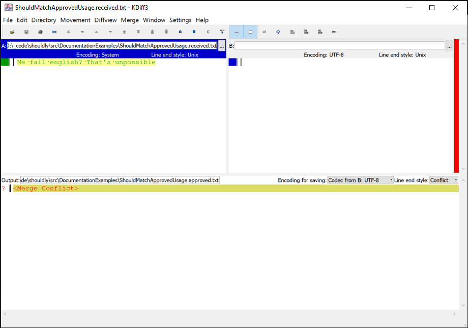

# ShouldMatchApproved

Based on the awesome `ApprovalTest.Net <https://github.com/approvals/ApprovalTests.Net>`, Shouldly has `ShouldMatchApproved()` to do approval based testing. The main goal of Shouldly's approval testing is for it to be simple, intuative and give great error messages.


## Approved File does not exist

When you first run a `ShouldMatchApproved` test, you will be presented with a diff viewer and a failing test.

<!-- snippet: ShouldMatchApprovedExamples.ApprovedFileDoesNotExist.codeSample.approved.cs -->
<a id='snippet-ShouldMatchApprovedExamples.ApprovedFileDoesNotExist.codeSample.approved.cs'></a>
```cs
var simpsonsQuote = "Hi Super Nintendo Chalmers";
simpsonsQuote.ShouldMatchApproved();
```
<sup><a href='/src/DocumentationExamples/CodeExamples/ShouldMatchApprovedExamples.ApprovedFileDoesNotExist.codeSample.approved.cs#L1-L2' title='File snippet `ShouldMatchApprovedExamples.ApprovedFileDoesNotExist.codeSample.approved.cs` was extracted from'>snippet source</a> | <a href='#snippet-ShouldMatchApprovedExamples.ApprovedFileDoesNotExist.codeSample.approved.cs' title='Navigate to start of snippet `ShouldMatchApprovedExamples.ApprovedFileDoesNotExist.codeSample.approved.cs`'>anchor</a></sup>
<!-- endSnippet -->

**Exception**

<!-- include: ShouldMatchApprovedExamples.ApprovedFileDoesNotExist.exceptionText.approved.txt. path: /src/DocumentationExamples/CodeExamples/ShouldMatchApprovedExamples.ApprovedFileDoesNotExist.exceptionText.approved.txt -->
```
To approve the changes run this command:
copy /Y "C:\PathToCode\shouldly\src\DocumentationExamples\ShouldMatchApprovedExamples.ApprovedFileDoesNotExist.received.txt" "C:\PathToCode\shouldly\src\DocumentationExamples\ShouldMatchApprovedExamples.ApprovedFileDoesNotExist.approved.txt"
----------------------------

Approval file C:\PathToCode\shouldly\src\DocumentationExamples\ShouldMatchApprovedExamples.ApprovedFileDoesNotExist.approved.txt
    does not exist
```
<!-- endInclude -->

**Screenshot**




## Approved File does not match received

After you have approved the text, when it changes you get a different experience.

<!-- snippet: ShouldMatchApprovedExamples.ApprovedFileIsDifferent.codeSample.approved.cs -->
<a id='snippet-ShouldMatchApprovedExamples.ApprovedFileIsDifferent.codeSample.approved.cs'></a>
```cs
var simpsonsQuote = "Me fail english? That's unpossible";
simpsonsQuote.ShouldMatchApproved();
```
<sup><a href='/src/DocumentationExamples/CodeExamples/ShouldMatchApprovedExamples.ApprovedFileIsDifferent.codeSample.approved.cs#L1-L2' title='File snippet `ShouldMatchApprovedExamples.ApprovedFileIsDifferent.codeSample.approved.cs` was extracted from'>snippet source</a> | <a href='#snippet-ShouldMatchApprovedExamples.ApprovedFileIsDifferent.codeSample.approved.cs' title='Navigate to start of snippet `ShouldMatchApprovedExamples.ApprovedFileIsDifferent.codeSample.approved.cs`'>anchor</a></sup>
<!-- endSnippet -->

**Exception**

<!-- include: ShouldMatchApprovedExamples.ApprovedFileIsDifferent.exceptionText.approved.txt. path: /src/DocumentationExamples/CodeExamples/ShouldMatchApprovedExamples.ApprovedFileIsDifferent.exceptionText.approved.txt -->
```
To approve the changes run this command:
copy /Y "C:\PathToCode\shouldly\src\DocumentationExamples\ShouldMatchApprovedExamples.ApprovedFileIsDifferent.received.txt" "C:\PathToCode\shouldly\src\DocumentationExamples\ShouldMatchApprovedExamples.ApprovedFileIsDifferent.approved.txt"
----------------------------

simpsonsQuote
    should match approved with options: Ignoring line endings
"Hi Super Nintendo Chalmers"
    but was
"Me fail english? That's unpossible"
    difference
Difference     |  |    |         |    |    |    |    |    |    |    |    |    |    |    |    |    |    |    |    |    |        
               | \|/  \|/       \|/  \|/  \|/  \|/  \|/  \|/  \|/  \|/  \|/  \|/  \|/  \|/  \|/  \|/  \|/  \|/  \|/  \|/       
Index          | 0    1    2    3    4    5    6    7    8    9    10   11   12   13   14   15   16   17   18   19   20   ...  
Expected Value | H    i    \s   S    u    p    e    r    \s   N    i    n    t    e    n    d    o    \s   C    h    a    ...  
Actual Value   | M    e    \s   f    a    i    l    \s   e    n    g    l    i    s    h    ?    \s   T    h    a    t    ...  
Expected Code  | 72   105  32   83   117  112  101  114  32   78   105  110  116  101  110  100  111  32   67   104  97   ...  
Actual Code    | 77   101  32   102  97   105  108  32   101  110  103  108  105  115  104  63   32   84   104  97   116  ...  

Difference     |       |    |    |    |    |    |    |    |    |    |    |    |    |    |    |    |    |    |    |    |    |   
               |      \|/  \|/  \|/  \|/  \|/  \|/  \|/  \|/  \|/  \|/  \|/  \|/  \|/  \|/  \|/  \|/  \|/  \|/  \|/  \|/  \|/  
Index          | ...  13   14   15   16   17   18   19   20   21   22   23   24   25   26   27   28   29   30   31   32   33   
Expected Value | ...  e    n    d    o    \s   C    h    a    l    m    e    r    s                                            
Actual Value   | ...  s    h    ?    \s   T    h    a    t    '    s    \s   u    n    p    o    s    s    i    b    l    e    
Expected Code  | ...  101  110  100  111  32   67   104  97   108  109  101  114  115                                          
Actual Code    | ...  115  104  63   32   84   104  97   116  39   115  32   117  110  112  111  115  115  105  98   108  101  
```
<!-- endInclude -->

**Screenshot**


## Options and customisation

While the defaults should work fine, often you need to customise things easily. ApprovalTests is highly configurable but the configuration is not always discoverable. Shouldly wants to make configuration simple and discoverable. This section covers the local customisations availble for a single ShouldMatchApproved call.


### Defaults

The first thing to note is that by default **Shouldly ignores line endings**. This saves painful failures on the build server when git checks out the approved files with \n rather than \r\n which the received file has. You can opt out of this behaviour for a single call, or globally. For global defaults see the Configuration section.


### Usage

```
toVerify.ShouldMatchApproved(configurationBuilder => configurationBuilder.OPTION())
```

Where OPTION can be one of the following methods.


### DoNotIgnoreLineEndings

Tells shouldly to use a line ending sensitive comparison.

```
toVerify.ShouldMatchApproved(c => c.DoNotIgnoreLineEndings())
```


### WithStringCompareOptions

Sets the string comparison options

```
var options = StringCompareShould.IgnoreCase | StringCompareShould.IgnoreLineEndings;
toVerify.ShouldMatchApproved(c => c.WithStringCompareOptions(options))
```


### WithDescriminator

By default the approved and received files are named `${MethodName}.approved.txt`, `WithDescriminator` allows you to descriminate multiple files, useful for data driven tests which can have multiple executions of a single method. For example

```
[Fact] void Simpsons() { toVerify.ShouldMatchApproved(c => c.WithDescriminator("Bart")) }
```

Will result in a approved file with the name `Simpsons.Bart.approved.txt`


### NoDiff

Prevents the diff viewer from opening up. Doing this you can use Shouldly's error messages to verify the changes then run the command in the exception message to approve the changes.

```
toVerify.ShouldMatchApproved(c => c.NoDiff())
```


### WithFileExtension

Override the file extension of the approved/received files. The default is .txt.

```
toVerify.ShouldMatchApproved(c => c.WithFileExtension(".cs"))
```


### SubFolder

Put the approved/received files into a sub-directory

```
toVerify.ShouldMatchApproved(c => c.SubFolder("Approvals"))
```


### UseCallerLocation

By default shouldly will walk the stacktrace to find the first non-shouldly method (not including anonymous methods and compiler generated stuff like the async state machine) and use that method for the approval filename. I.e a test named `MyTest` will result in a received filename of `MyTest.received.txt`.

This setting tells shouldly to walk one more frame, this is really handy when you have created a utility function which calls `ShouldMatchApproved`.

```
[Fact]
public void MyTest()
{
    SomeUtilityMethod("Foo");
}

void SomeUtilityMethod(string toApprove)
{
    toApprove.ShouldMatchApproved(c => c.UseCallerLocation());
}

// -> MyTest.received.txt - without UseCallerLocation() the file would be called SomeUtilityMethod.received.txt
```


### LocateTestMethodUsingAttribute

If you want to locate your test method using an attribute that is easy too!

```
// XUnit
"testAttributes".ShouldMatchApproved(b => b.LocateTestMethodUsingAttribute<FactAttribute>());
// NUnit
"testAttributes".ShouldMatchApproved(b => b.LocateTestMethodUsingAttribute<TestAttribute>());
```


### WithScrubber

Scrubbers allow you to remove dynamic content, such as the current date

```
toVerify.ShouldMatchApproved(c => c.WithScrubber(s => Regex.Replace(s, "\d{1,2}/\d{1,2}/\d{2,4}", "<date>"))
```

Will turn `Today is 01/01/2016` into `Today is <date>` in the received file.


## Configuration

Because this feature is quite new shouldly doesn't have many Diff tools or know all the places it shouldn't open the diff tool. The global configuration of Shouldly is very easy to change and extend. If you do add a difftool or a should not open difftool strategy then please submit a pull request so everyone gets the benefits!


### Changing default options

All of the instance based configuration can be changed globally through `ShouldlyConfiguration.ShouldMatchApprovedDefaults`. For example to make the default behaviour be line ending sensitive you can just run this before any tests execute `ShouldlyConfiguration.ShouldMatchApprovedDefaults.DoNotIgnoreLineEndings()`


### Adding a difftool

So Shouldly doesn't support your favorite difftool yet. No worries, it's easy to add your own.

```
var diffomatic3000 = new DiffTool(
    "Diffomatic3000",
    @"diffomatic3000\diffomatic3000.exe",
    (received, approved, approvedExists) => string.Format("\"{0}\" \"{1}\"", received, approved));
ShouldlyConfiguration.DiffTools.RegisterDiffTool(diffomatic3000);
```

This will discover diffomatic3000.exe if it's in your PATH or if it exists in any Program Files directory under diffomatic3000\diffomatic3000.exe

If you do this, please submit a PR to add it to the `KnownDiffTools`, you can also test how it works by running the Shouldly.Tests\TestDiffTools project!


### Adding a do not launch difftool strategy

We don't really want to be opening difftools in nCrunch, or on the build server and a number of other scenarios. So `ShouldlyConfiguration.DiffTools.KnownDoNotLaunchStrategies` allows you to add in scenarios which Shouldly doesn't know about yet. Once again, please submit PR's if you need to do this :)

Currently the only strategy is to check for environmental variables, but you can implement `IShouldNotLaunchDiffTool` to implement any logic you want. Assuming it's just an environmental variable:

```
ShouldlyConfiguration.DiffTools.AddDoNotLaunchStrategy(new DoNotLaunchWhenEnvVariableIsPresent("NCRUNCH"));
```


### Setting Diff tool priority

Shouldly launches the first found difftool, if you want to give priority to another difftool you can do that.

```
ShouldlyConfiguration.DiffTools.SetDiffToolPriorities(
  KnownDiffTools.Instance.BeyondCompare4,
  KnownDiffTools.Instance.KDiff3);
```

The priority tools will be checked before falling back to the entire known difftool list.
